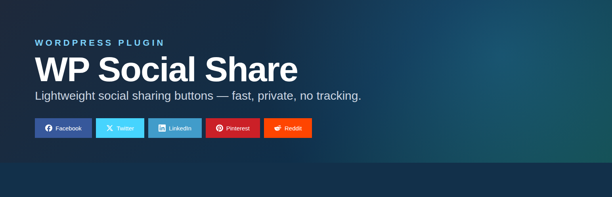
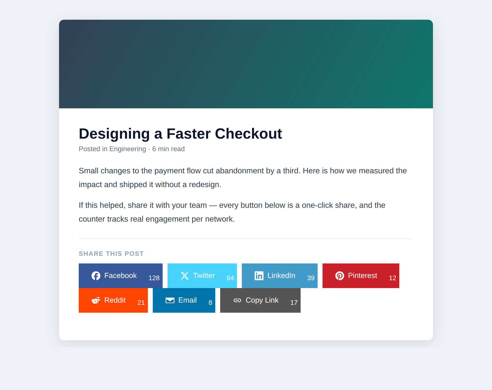
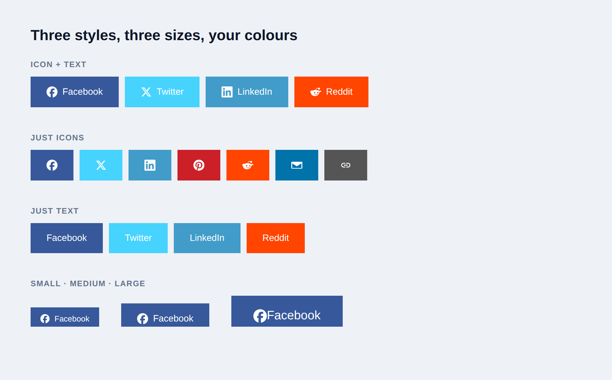
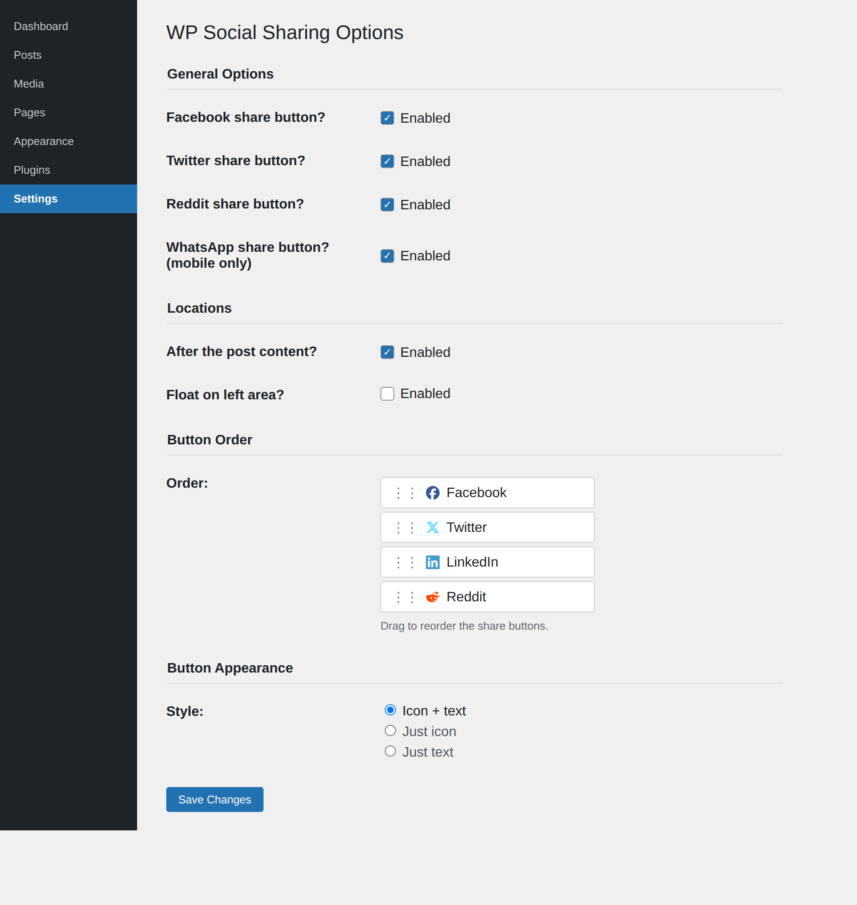
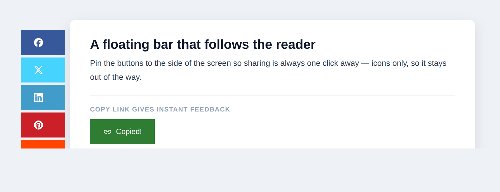

<p align="center">
  
</p>

<h1 align="center">WP Social Share</h1>

<p align="center">
  <strong>Social share buttons that are fast, private, and yours to style.</strong>
</p>

<p align="center">
  A free WordPress plugin for bloggers, agencies and site owners. WP Social Share adds clean,
  customisable share buttons to your posts, pages and custom post types — Facebook, Twitter/X,
  LinkedIn, Pinterest, WhatsApp, Reddit, Email and a copy-link button — with per-post click
  tracking, drag-and-drop ordering and <strong>no third-party tracking scripts</strong>.
</p>

<p align="center">
  
  
  
  
</p>

<p align="center">
  <a href="#-quick-start-under-2-minutes">Quick start</a> ·
  <a href="#what-the-plugin-includes">Features</a> ·
  <a href="#screenshots">Screenshots</a> ·
  <a href="#shortcode">Shortcode</a> ·
  <a href="#roadmap">Roadmap</a> ·
  <a href="#development">Development</a>
</p>

<p align="center">
  Author: <a href="https://www.nomad-developer.co.uk/">Costin Botez</a> (<a href="https://www.instagram.com/costinbotez/">@costinbotez</a>) ·
  <a href="https://www.nomad-developer.co.uk/">Portfolio</a> ·
  <a href="https://www.instagram.com/costinbotez/">Instagram</a> ·
  <a href="https://github.com/costibotez">GitHub</a>
</p>

---

## Why WP Social Share exists

Most social-sharing plugins ship a pile of third-party JavaScript, load network SDKs that
watch your visitors, and slow every page down for a row of buttons. WP Social Share does the
opposite: it renders plain share links with your own styling, counts clicks in your own
database, and loads its tiny CSS/JS **only on the pages that actually show buttons**. No
external scripts, no visitor tracking, no bloat.

You decide which networks appear, where they sit, what they look like, and in what order —
from one settings screen — or drop them anywhere with a shortcode.

## What the plugin includes

### 🔗 Eight share destinations
Facebook, Twitter/X, LinkedIn, Pinterest, Reddit, Email and a **copy-link** button, plus a
**WhatsApp** button that shows on touch devices only. Every network is defined in one registry
and is filterable, so adding your own is a one-line change (see [Development](#development)).

### 🎨 Styled to match your theme
Three appearance styles — **icon only**, **text only**, or **icon + text** — in **small**,
**medium** or **large** sizes. Set a custom background and font colour per network with the
built-in WordPress colour picker, or keep each network's brand colour.

### 📍 Place them anywhere
Show buttons **below the title**, **after the content**, **inside the featured image**, or as a
**floating bar** pinned to the side of the screen. Enable them per post type — posts, pages,
and custom post types — and **drag to reorder** the buttons exactly how you want.

### 📊 Private per-post share counts
Each click is counted against the post in your own database and shown next to the button — no
calls to network APIs. The endpoint is **nonce-protected**, validates the target post, and is
**rate-limited** so counts can't be inflated in a loop.

### ⚡ Loads only when needed
Styles and scripts enqueue **only on singular views that render buttons** (or contain the
shortcode), are version-stamped for clean cache-busting, and the frontend script is
dependency-free vanilla JavaScript — no jQuery on the front end.

### 🔒 Private by design
No third-party SDKs, no social-network tracking pixels, no external requests for visitors.
Uninstalling removes every option **and** the share-count post meta it created.

## ⚡ Quick start (under 2 minutes)

1. Copy the plugin folder into `wp-content/plugins/` (or upload the ZIP via **Plugins → Add New**).
2. Activate **WP Social Share** from the Plugins screen.
3. Go to **Settings → WP Social Share** and pick your networks, locations, style and order.
4. Save — buttons appear on your posts and pages immediately. Fresh installs enable Facebook,
   Twitter and LinkedIn after the content by default, so there's nothing to configure to get going.

## Screenshots

| Share buttons in action | Styles & sizes |
|---|---|
|  |  |

| Settings screen | Floating bar & copy link |
|---|---|
|  |  |

## Shortcode

Drop buttons anywhere with the `[toptal_ss]` shortcode. All attributes are optional; omit any
and the settings-page defaults are used.

```
[toptal_ss size="medium" facebook="1" twitter="1" linkedin="1" pinterest="0" whatsapp="0"]
```

| Attribute | Values | Purpose |
|---|---|---|
| `size` | `small` · `medium` · `large` | Button size for this instance |
| `facebook` `twitter` `linkedin` `pinterest` `whatsapp` `reddit` `email` `copylink` | `0` · `1` | Show or hide a network for this instance |

## Roadmap

- Native **Web Share API** button (system share sheet on supported devices)
- More networks (Telegram, Mastodon, Bluesky) once the icon set moves to inline SVG
- **Gutenberg block** alongside the shortcode
- Per-post overrides (hide or override networks on a single post)
- Optional **UTM tagging** of shared URLs for analytics attribution
- A "most shared posts" dashboard widget built on the existing counts

## Development

**Requirements:** PHP 7.4+ and WordPress 5.0+.

The main file is a thin bootstrap; the code lives in `includes/`, split by concern, and is
driven by a single filterable network registry.

```
toptal-social-share.php   Bootstrap: constants, activation, text domain, wiring
uninstall.php             Full cleanup (all options + share-count post meta)
includes/
  class-toptal-ss-networks.php   Network registry (label, icon, share URL) — filterable
  class-toptal-ss-options.php    Single-array settings: defaults, order, legacy migration
  class-toptal-ss-settings.php   Admin settings screen (fields generated from the registry)
  class-toptal-ss-renderer.php   Frontend markup: content/title/thumbnail filters, shortcode, floating bar
  class-toptal-ss-assets.php     Conditional, version-stamped asset enqueueing
  class-toptal-ss-ajax.php       Nonce-protected, rate-limited share-count endpoint
assets/                   Frontend + admin CSS, Font Awesome, vanilla-JS scripts
tests/                    Stubbed smoke-test suite (no WordPress install required)
.github/workflows/ci.yml  Lint matrix (PHP 7.4–8.3) + PHPCS + smoke tests
```

### Extending it

| Hook | Type | Purpose |
|---|---|---|
| `toptal_ss_networks` | filter | Add, remove or modify share networks (label, icon, share URL, `mobile_only`, `new_tab`, `action`) |
| `[toptal_ss]` | shortcode | Render buttons in content, with per-instance size and network overrides |

Adding a network is a single entry in the registry — it then appears automatically in the
settings screen, the rendered output, the drag-and-drop order list and the share-count
whitelist.

### Quality checks

```bash
composer install     # PHPCS (WordPress-Extra + PHPCompatibilityWP) and dev tooling
composer lint        # php -l across every PHP file
composer phpcs       # WordPress coding standards
composer test        # stubbed smoke-test suite
```

The same checks run in CI on every push and pull request across PHP 7.4–8.3.

## License

MIT — see the plugin header. Do what you like; attribution appreciated.

<p align="center">
  Built by <a href="https://www.nomad-developer.co.uk/">Costin Botez</a> ·
  <a href="https://www.instagram.com/costinbotez/">Instagram</a> ·
  <a href="https://github.com/costibotez">GitHub</a><br>
  If this plugin is useful to you, <a href="https://buymeacoffee.com/costinbotez">buy me a coffee</a> ☕
</p>
